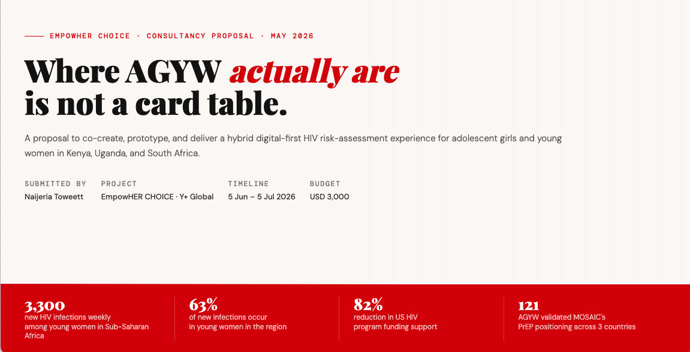

# EmpowHER CHOICE — HIV Prevention Card Game Consultancy Proposal

**Response to:** Consultant to Develop an Interactive HIV Prevention Card Game under the EmpowHER Fund

**Applicant:** Naijeria Toweett · MamaTech Africa  
**Submitted to:** Y+ Global / EmpowHER CHOICE Consortium  
**Deadline:** 30 May 2026

---

## Overview

This repository contains a complete proposal response to the Terms of Reference (TOR) issued by Y+ Global under the EmpowHER Fund (funded by Aidsfonds, 2026–2028). The consultancy seeks a qualified consultant to co-create, prototype, and pre-test a contextually relevant, user-centred HIV risk-assessment card game for adolescent girls and young women (AGYW) in Kenya, Uganda, and South Africa.

## Contents

| File | Purpose |
|---|---|
| `index.html` | Interactive card-game-style proposal site — live demo of the proposed game, full methodology, deliverables, and applicant profile. Serves as both **cover letter** and **work sample**. |
| *(inline CV)* | Curriculum Vitae content is embedded within the site in a dedicated section. |

## What You Can Do Here

- **Play the demo** — The interactive card game at the heart of the proposal is playable directly in the browser. Four card types (Risk Scenario, Prevention Option, Myth Bust, Decision Prompt) with real MOSAIC-research-informed content.
- **Explore the methodology** — A 5-phase approach: Inception → Co-Creation → Prototype Build → Pre-Testing → Final Package + Training.
- **Review evidence** — MOSAIC research findings, regional gamification evidence (Tumaini, Tanzania GBL, URUKUNDO, AskRafikey).
- **Submit an application** — The site includes a complete application builder for CV, cover letter, and work samples with download capability.

## How to Use

Open `index.html` in any modern browser. No build step, no server, no dependencies. Designed for desktop and mobile.

### Download as Documents

The site includes a built-in tool to export your completed application as three printable documents:
1. **Curriculum Vitae** (max 3 pages)
2. **Cover Letter** (1 page)
3. **Samples of Previous Work**

Edit the content inline and download each as an HTML document ready for printing or PDF conversion.

## Key Dates

- **Commencement:** 5 June 2026
- **Completion:** 5 July 2026
- **Budget:** USD 3,000

## Contact

**Naijeria Toweett**  
Founder, MamaTech Africa  
Kilifi, Kenya  
naijeria@mamatech.co.ke

**Apply to:** ijebet@yplusglobal.org  
**Subject line:** `[NAME]_EmpowHER_Game Design_Consultancy`

---

*Built with HTML, CSS, and vanilla JavaScript. No frameworks. No dependencies.*
